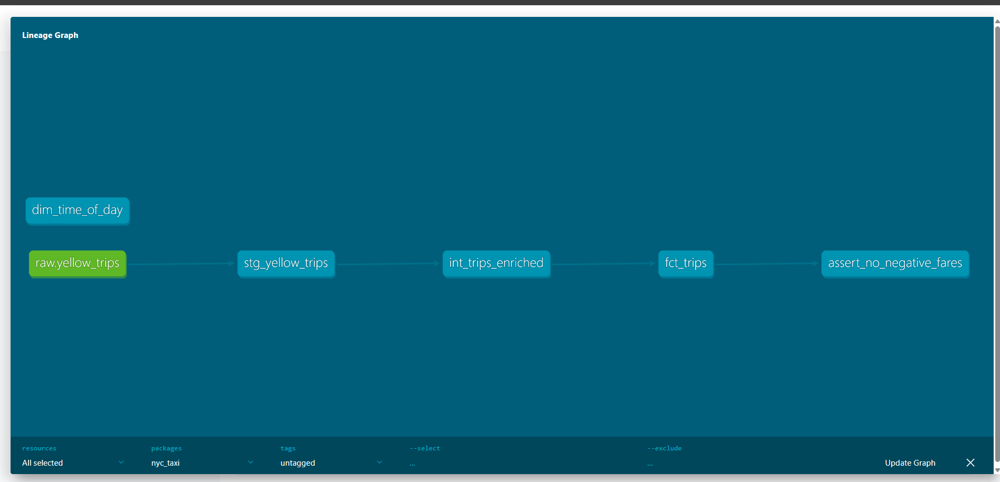

# NYC Taxi Analytics Pipeline

End-to-end data engineering project using BigQuery, dbt, and Prefect.

**Stack:** Google BigQuery · dbt Core · Prefect · Python 3.10+  
**Source data:** `bigquery-public-data.new_york_taxi_trips.tlc_yellow_trips_*`

---

## Project structure

```
de_project/
├── ingestion/              # Python scripts to load raw data into BigQuery
│   ├── ingest.py           # Main ingestion script
│   └── bq_client.py        # BigQuery client helper
├── dbt_project/            # All dbt models, tests, and docs
│   ├── dbt_project.yml
│   ├── profiles.yml        # Connection config (gitignored)
│   ├── models/
│   │   ├── staging/        # stg_* — clean raw data, no joins
│   │   ├── intermediate/   # int_* — joins and business logic
│   │   └── marts/          # fct_* and dim_* — final queryable tables
│   ├── tests/              # Custom singular tests
│   └── macros/             # Reusable Jinja macros
├── orchestration/
│   └── pipeline_flow.py    # Prefect flow wrapping ingest + dbt
├── docs/                   # Screenshots, lineage graphs
├── requirements.txt
└── .env.example
```

---

## Quickstart

### 1. GCP setup
1. Create a free GCP account at https://cloud.google.com
2. Create a new project, enable the BigQuery API
3. Create a service account, download the JSON key
4. Set the env var: `export GOOGLE_APPLICATION_CREDENTIALS=/path/to/key.json`
5. Create two BigQuery datasets in your project: `raw` and `dbt_nyc_taxi`

### 2. Python environment
```bash
python -m venv .venv
source .venv/bin/activate
pip install -r requirements.txt
```

### 3. dbt setup
```bash
cd dbt_project
dbt debug          # verify connection
dbt deps           # install packages
dbt run            # run all models
dbt test           # run all tests
dbt docs generate  # build lineage docs
dbt docs serve     # open in browser
```

### 4. Run the full pipeline via Prefect
```bash
cd orchestration
python pipeline_flow.py       # runs once locally
prefect deploy                # deploy to Prefect Cloud
```

---

## Data lineage



```
bigquery-public-data (source)
    └── stg_yellow_trips          (staging — Silver)
            └── int_trips_enriched    (intermediate — Silver)
                    ├── fct_trips             (fact table — Gold, 8.5M rows)
                    ├── dim_time_of_day       (dimension — Gold, 5 rows)
                    └── dim_pickup_zones      (dimension — Gold, 260 rows)
```

---

## Key dbt concepts demonstrated

- Source freshness checks (`dbt source freshness`)
- Generic tests: `not_null`, `unique`, `accepted_values`
- Singular tests: custom SQL assertions
- Incremental models (see `fct_trips.sql`)
- Jinja macros for reusable logic
- `dbt docs generate` for data lineage graph

---

## Extending this project

Ideas to go further and strengthen your portfolio:
- Add a second source (e.g. weather data) and join it in an `int_` model
- Swap Prefect for Airflow (Astronomer free tier) to compare orchestrators
- Add a Looker Studio dashboard connected to `fct_trips`
- Implement CI with GitHub Actions running `dbt test` on pull requests

## Orchestration

The full pipeline is orchestrated with Prefect. Each step runs as a separate task with retries configured, and the entire flow is logged to Prefect Cloud.

### Pipeline flow

ingest-raw-data → dbt-run → dbt-test → dbt-docs

### Run the pipeline locally
```bash
cd orchestration
python pipeline_flow.py
```

### Flow run monitoring
Flow runs are logged to Prefect Cloud and can be monitored at app.prefect.cloud. Each run shows:
- Task-level logs and timing
- Pass/fail status for each step
- Retry attempts if a task fails
- Full pipeline duration

### Prefect concepts demonstrated
- `@flow` and `@task` decorators
- Task retries with `retries=2, retry_delay_seconds=60`
- Task dependencies with `wait_for`
- Integration with dbt via subprocess
- Logging with `get_run_logger()`
